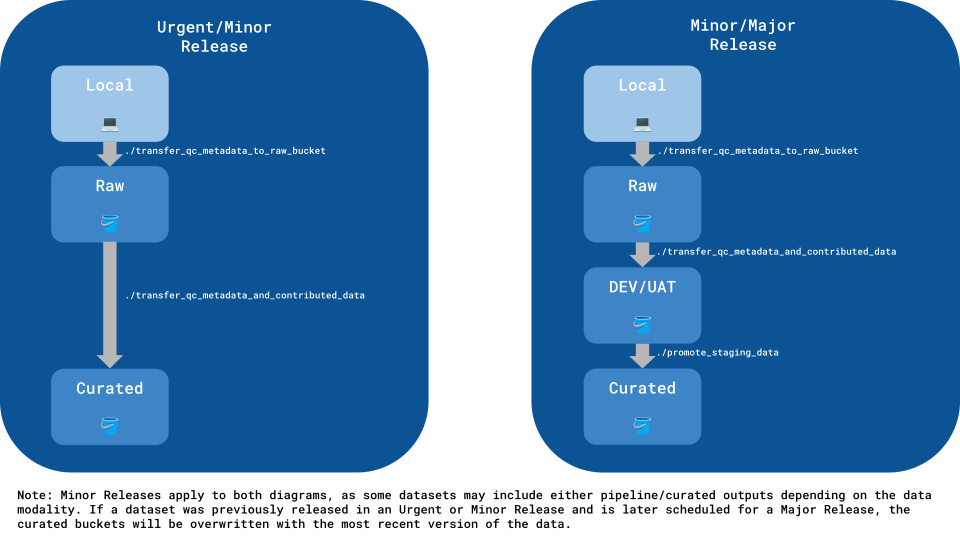

# util scripts

| Script | Description | Context |
| :- | :- | :- |
| [`common.py`](./common.py) | Common lists and functions used across scripts. | Ability to reuse common lists and functions. |
| [`generate_inputs`](./generate_inputs) | Generate inputs JSON for WDL pipelines. | Ability to generate the inputs JSON for WDL pipelines given a project TSV (sample information), inputs JSON template, workflow name, and cohort dataset name. |
| [`validate_raw_bucket_structure.py`](./validate_raw_bucket_structure.py) | Ensure that the raw bucket has the appropriate directories after contributor upload. | Contributions require at least the ```metadata/``` directory, and this will further check for additional optional contributed directories. |
| [`transfer_raw_bucket_metadata_to_local`](./transfer_raw_bucket_metadata_to_local) | Sync raw bucket metadata to the local metadata directory. | Once authors have contributed their metadata to the raw bucket, this script downloads this data locally so that QC can be performed. |
| [`transfer_qc_metadata_to_raw_bucket`](./transfer_qc_metadata_to_raw_bucket) | Sync local metadata directory to the raw bucket. | After receiving author-contributed metadata from a raw bucket, QC/processing steps must be done locally. This script is run after QC is complete, so that the locally changed metadata directories are sync'd to the raw bucket. If any later changes are made to the metadata, this script will need to be re-run to ensure that the raw bucket contains the most up to date copies of the QC'd metadata. |
| [`transfer_qc_metadata_and_contributed_data`](./transfer_qc_metadata_and_contributed_data) | Transfer QC'ed metadata, CRN Team contributed artifacts, and other CRN Team contributed data (e.g., spatial) from raw data buckets to staging (for Urgent/Minor releases) *or* production buckets (for Minor/Major releases). | Ability to transfer QC'ed metadata and CRN Team contributed data from raw buckets to staging/production buckets. This script is run for all releases: Urgent, Minor, and Major. It also removes the `internal-qc-data` label from the released raw buckets for Urgent/Minor releases. The rationale behind moving this type of data to production buckets (i.e., CURATED) for Urgent/Minor releases is because there are no pipeline/curated outputs, so the staging buckets are not used. The rationale behind moving this type of data to staging buckets (i.e., DEV/UAT) for Minor/Major releases is because there are pipeline/curated outputs, so the [`promote_staging_data`](./promote_staging_data) is used and will eventually copy the data over to production buckets. Minor releases are applicable to both here because sometimes datasets are only platformed in a Minor release, but there are other times where datasets are run through *existing* pipelines. **Note: this script must be run before [`promote_staging_data`](./promote_staging_data).** |
| [`promote_staging_data`](./promote_staging_data) | Promote staging data to production data buckets and apply the appropriate permissions. | Ability to run data integrity tests when trying to promote data from staging (i.e., DEV/UAT) to production buckets (i.e., CURATED). This script is only run for Minor and Major releases. It also applies the appropriate permissions to the buckets (e.g., adding Verily's ASAP Cloud Readers to released raw buckets) and removes the `internal-qc-data` label from the released raw buckets. |
| [`markdown_generator.py`](./markdown_generator.py) | Functions that generate a Markdown report. | This script is used in the [`promote_staging_data`](./promote_staging_data) script to generate a Markdown report that contains data integrity results when trying to promote data from staging (i.e., DEV/UAT) to production buckets (i.e., CURATED). |
| [`crn_cloud_collection_summary`](./crn_cloud_collection_summary) | Track the ASAP raw/curated buckets, size, and sample breakdown in the CRN Cloud. | This script is used to grab the raw/curated buckets, size, and sample breakdown with the dnastack CLI for querying in Explorer/CRN Cloud. |

## Deprecated util scripts

| Script | Description | Context |
| :- | :- | :- |
| [`transfer_raw_data`](./transfer_raw_data) | Transfer data in generic raw buckets to dataset-specific raw buckets (e.g., `gs://asap-raw-data-team-lee` vs. `gs://asap-dev-team-lee-pmdbs-sn-rnaseq`. | Originally, "generic" raw buckets were created because we only had one data type (i.e., sc RNAseq). Later on, we started implementing new data types (e.g., bulk RNAseq, spatial transcriptomics, etc.) and restructured the bucket naming and organization. Therefore, this script is used to move raw data from the generic raw buckets to data-specific raw buckets. It is not applicable to new datasets where we collaborate with the CRN Teams to determine the dataset name. |


# Scripts used when contributors first upload data to the raw bucket
1. ```validate_raw_bucket_structure```
2. ```transfer_raw_bucket_metadata_to_local```
3. QC is performed locally and is organized in the [asap-crn-cloud-dataset-metadata](https://github.com/ASAP-CRN/asap-crn-cloud-dataset-metadata) GitHub Repo (WIP: instructions for initiating a new dataset)
4. ```transfer_qc_metadata_to_raw_bucket```


# Scripts used to copy data for different Data Release scenarios
| Data Release Scenario | Script Used |
| :- | :- |
| Urgent | <ul><li>[`transfer_qc_metadata_to_raw_bucket`](./transfer_qc_metadata_to_raw_bucket)</li><li>[`transfer_qc_metadata_and_contributed_data`](./transfer_qc_metadata_and_contributed_data)</li></ul> |
| Minor | <ul><li>[`transfer_qc_metadata_to_raw_bucket`](./transfer_qc_metadata_to_raw_bucket)</li><li>[`transfer_qc_metadata_and_contributed_data`](./transfer_qc_metadata_and_contributed_data)</li><li>[`promote_staging_data`](./promote_staging_data)</li></ul> |
| Major | <ul><li>[`transfer_qc_metadata_to_raw_bucket`](./transfer_qc_metadata_to_raw_bucket)</li><li>[`transfer_qc_metadata_and_contributed_data`](./transfer_qc_metadata_and_contributed_data)</li><li>[`promote_staging_data`](./promote_staging_data)</li></ul> |

**Scripts used in different Data Release Scenarios diagram:**


Note: Previous Minor Releases did not contain pipeline/curated outputs (SOW 2); however, moving forward there will be outputs (SOW 3 - onwards) [06/12/2025]. Minor Releases apply to both diagrams, as some datasets may include either pipeline/curated outputs depending on the data modality. If a dataset was previously released in an Urgent or Minor Release and is later scheduled for a Major Release, the curated buckets will be overwritten with the most recent version of the data.
