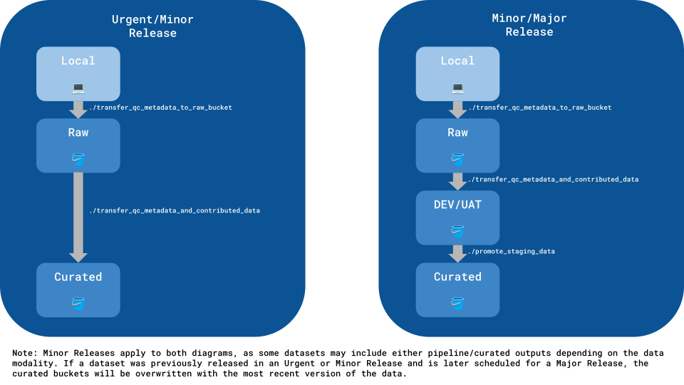

# util scripts

| Script | Description | Context | Example usage |
| :- | :- | :- | :- |
| [`common.py`](./common.py) | Common lists and functions used across scripts. | Ability to reuse common lists and functions. | NA |
| [`bucket_validation_utils.py`](./bucket_validation_utils.py) | Functions to validate raw bucket and local metadata structure and contents before transferring data. | Checks preceding data transfers. | NA |
| [`generate_inputs`](./generate_inputs) | Generate inputs JSON for WDL pipelines. | Ability to generate the inputs JSON for WDL pipelines given a project TSV (sample information), inputs JSON template, workflow name, and cohort dataset ID. | `./generate_inputs --project-tsv lee.metadata.tsv --inputs-template inputs.json --workflow-name pmdbs_sc_rnaseq_analysis --cohort-dataset-id cohort-pmdbs-sc-rnaseq` |
| [`validate_raw_bucket_structure.py`](./validate_raw_bucket_structure.py) | Ensure that the raw bucket has the appropriate directories after contributor upload. | Contributions require at least the `metadata/` directory and minimal metadata .CSVs, and this will further check for additional optional contributed directories. | `python3 validate_raw_bucket_structure.py -d team-jakobsson-pmdbs-bulk-rnaseq` |
| [`download_raw_bucket_metadata_to_local`](./download_raw_bucket_metadata_to_local) | Sync raw bucket metadata to the local metadata directory. | Once authors have contributed their metadata to the raw bucket, this script downloads this data locally so that QC can be performed. | `./download_raw_bucket_metadata_to_local -d team-jakobsson-pmdbs-bulk-rnaseq` |
| [`transfer_qc_metadata_to_raw_bucket`](./transfer_qc_metadata_to_raw_bucket) | Sync local metadata directory to the raw bucket. | After receiving author-contributed metadata from a raw bucket, QC/processing steps must be done locally. This script is run after QC is complete, so that the locally changed metadata directories are sync'd to the raw bucket. If any later changes are made to the metadata, this script will need to be re-run to ensure that the raw bucket contains the most up to date copies of the QC'd metadata. | `./transfer_qc_metadata_to_raw_bucket -d team-jakobsson-pmdbs-bulk-rnaseq -v v4.0.0`|
| [`promote_raw_data`](./promote_raw_data) | Transfer QC'ed metadata, CRN Team contributed artifacts, and other CRN Team contributed data (e.g., spatial) from raw data buckets to staging (for Urgent/Minor releases) *or* production buckets (for Minor/Major releases). | Ability to transfer QC'ed metadata and CRN Team contributed data from raw buckets to staging/production buckets. This script is run for all releases: Urgent, Minor, and Major. It also removes the `internal-qc-data` label from the released raw buckets for Urgent/Minor releases. The rationale behind moving this type of data to production buckets (i.e., CURATED) for Urgent/Minor releases is because there are no pipeline/curated outputs, so the staging buckets are not used. The rationale behind moving this type of data to staging buckets (i.e., DEV/UAT) for Minor/Major releases is because there are pipeline/curated outputs, so the [`promote_staging_data`](./promote_staging_data) is used and will eventually copy the data over to production buckets. Minor releases are applicable to both here because sometimes datasets are only platformed in a Minor release, but there are other times where datasets are run through *existing* pipelines. **Note: this script must be run before [`promote_staging_data`](./promote_staging_data).** | `./promote_raw_data --type-of-release urgent --all-datasets --release-version v4.0.0` |
| [`promote_staging_data`](./promote_staging_data) | Promote staging data to production data buckets and apply the appropriate permissions. | Ability to run data integrity tests when trying to promote data from staging (i.e., DEV/UAT) to production buckets (i.e., CURATED). This script is only run for Minor and Major releases. It also applies the appropriate permissions to the buckets (e.g., adding Verily's ASAP Cloud Readers to released raw buckets) and removes the `internal-qc-data` label from the released raw buckets. The buckets/datasets are detected based on the workflow name provided and the workflow/pipeline version that's used to store current curated outputs in raw workflow_execution bucket. This dict, `unembargoed_dev_buckets_and_workflow_version_outputs`, is in `common.py` | `./promote_staging_data -w pmdbs_sc_rnaseq` |
| [`markdown_generator.py`](./markdown_generator.py) | Functions that generate a Markdown report. | This script is used in the [`promote_staging_data`](./promote_staging_data) script to generate a Markdown report that contains data integrity results when trying to promote data from staging (i.e., DEV/UAT) to production buckets (i.e., CURATED). | NA |
| [`crn_cloud_collection_summary`](./crn_cloud_collection_summary) | Track the ASAP raw/curated buckets, size, sample breakdown, and subject breakdown in the CRN Cloud. | See [CRN Cloud Statistics](#crn-cloud-statistics) below for more details. | `./crn_cloud_collection_summary` |
| [`internal_qc_dataset_collection_summary`](./internal_qc_dataset_collection_summary) | Track datasets in internal QC by getting their ASAP raw buckets, size, sample, and subject breakdown in GCP. | See [CRN Cloud Statistics](#crn-cloud-statistics) below for more details. | `./internal_qc_dataset_collection_summary` |
| [`transfer_release_resources_to_raw_bucket.py`](./transfer_release_resources_to_raw_bucket.py) | Sync local release-resources config/, release_stats/ and publisher_cards/ to dataset ASAP raw buckets. | After producing Publisher card text and summary figures, this script syncs locally stored files (presumably living at asap-crn-cloud-dataset-metadata/) into each dataset gs:// raw bucket. If any later changes are made to the release-resources, this script will need to be re-run to ensure that the raw bucket contains the most up to date copies. | `./transfer_release_resources_to_raw_bucket.py -i /path/to/release_<release_version>.json -p`|

## Deprecated util scripts

| Script | Description | Context |
| :- | :- | :- |
| [`transfer_raw_data`](./archive/transfer_raw_data) | Transfer data in generic raw buckets to dataset-specific raw buckets (e.g., `gs://asap-raw-data-team-lee` vs. `gs://asap-dev-team-lee-pmdbs-sn-rnaseq`. | Originally, "generic" raw buckets were created because we only had one data type (i.e., sc RNAseq). Later on, we started implementing new data types (e.g., bulk RNAseq, spatial transcriptomics, etc.) and restructured the bucket naming and organization. Therefore, this script is used to move raw data from the generic raw buckets to data-specific raw buckets. It is not applicable to new datasets where we collaborate with the CRN Teams to determine the dataset name. |

# Contributor Data Workflow

This section describes the workflow for processing contributor submissions, from initial upload through QC and back to the raw bucket.

See documentation in the [asap-crn-cloud-dataset-metadata](https://github.com/ASAP-CRN/asap-crn-cloud-dataset-metadata/blob/main/README.md) repo for more granular information on the steps pertaining to releasing a contributed dataset.

## Workflow Steps

### 1. Validate Bucket Structure

**Script:** [`validate_raw_bucket_structure.py`](./validate_raw_bucket_structure.py)

Validates that the raw bucket has the required directory structure and metadata files after contributor upload.

```bash
python3 validate_raw_bucket_structure.py -d team-jakobsson-pmdbs-bulk-rnaseq
```

### 2. Download Metadata Locally

**Script:** [`download_raw_bucket_metadata_to_local`](./download_raw_bucket_metadata_to_local)

Downloads metadata from the raw bucket to your local workspace for QC. Handles both initial submissions (loose CSV files) and post-QC structures (organized directories).

```bash
./download_raw_bucket_metadata_to_local -d team-jakobsson-pmdbs-bulk-rnaseq
```

**What it does:**

- **Initial submission:** Downloads `metadata/*.csv` → local `metadata/original/`
- **Re-sync:** Downloads entire `metadata/` tree plus `file_metadata/` and `DOI/` if present
- **Optional:** Also downloads `file_metadata/` and `DOI/` if present in bucket

### 3. Perform QC Locally

Quality control is performed locally in the [asap-crn-cloud-dataset-metadata](https://github.com/ASAP-CRN/asap-crn-cloud-dataset-metadata) repository.

**QC outputs:**

```
metadata/
├── original/     # Contributor submission
├── cde/          # CDE-versioned copies
├── release/      # Release-versioned metadata (e.g., v4.0.0/)
└── latest/       # Copy of the latest release version
```

### 4. Transfer QC'd Metadata Back to Bucket

**Script:** [`transfer_qc_metadata_to_raw_bucket`](./transfer_qc_metadata_to_raw_bucket)

Syncs the local metadata directory (including all QC'd subdirectories) back to the raw bucket.

```bash
./transfer_qc_metadata_to_raw_bucket -d team-jakobsson-pmdbs-bulk-rnaseq -v v4.0.0 -p
```

**What it transfers:**

- Entire `metadata/` directory tree
- `file_metadata/` (if present)
- `DOI/` (if present)

**Note:** Use `-p` flag to execute (defaults to dry-run for safety).

### 5. Build release-resources

Build Publisher collection cards text and figures using:
**Script:** `make_release.py` in the [asap-crn-cloud-dataset-metadata](https://github.com/ASAP-CRN/asap-crn-cloud-dataset-metadata) repository.

```bash
/path/to/make_release -i /path/to/release_<release_version>.json -p
```

**release-resources outputs:**

```
release-resources/
└─ {release_version}/
    ├─ cde/
    ├─ release_stats/
    │  └─ {dataset_name}/
    └─ publisher_cards/
       └─ {dataset_name}/
           ├─ figures/
           └─ text/
```

### 6. Transfer release-resources to Dataset Raw Buckets

**Script:** [`transfer_release_resources_to_raw_bucket.py`](./transfer_release_resources_to_raw_bucket.py)

Syncs the local release-resources directory (including all QC'd subdirectories) back to the raw bucket.

```bash
./transfer_release_resources_to_raw_bucket.py -i /path/to/config/release_<release_version>.json -p
```

**What it transfers:**

- Entire `config/release_<release_version>.json`
- `publisher_cards/` html files
- `release_stats/` final svg files

**Note:** Use `-p` flag to execute (defaults to dry-run for safety).

---

## Important Notes

- **Dry-run by default:** Most scripts require `-p` (promote) flag to actually execute transfers
- **Structure migration:** First transfer after QC from local to the raw bucket establishes the new directory structure (`original/`, `cde/`, `release/`, `latest/`) in the bucket
- **Re-running scripts:** Safe to re-run download/transfer scripts - the rysnc command will replace changed files and add new source files to destination, but will not remove files that exist in destination but not source
- **Missing files:** Scripts warn about missing CORE metadata tables but allow incomplete submissions (for flexibility during initial upload)

# Expected structure and files of a contribution

Contributors are expected to deposit their data and metadata in a structured manner in the given dataset's raw bucket. The bucket structure is organized into **required**, **recommended**, and **optional** directories. Note that a contribution consists of the metadata and deposited data, however the form of this data (processed outputs or raw data) will vary by assay. Thus, a submission should at minumum have `metadata/` and a data directory such as `raw/` or `fastqs/`, and preferably include the author's own processed data in `artifacts/`.

## Directory Structure

### Required Directories

- **`metadata/`** - Contains 'core' and 'supplemental' metadata tables (see [Metadata Files](#metadata-files) below)

### Recommended Directories

- **`artifacts/`** - Processed outputs of data pipelines

### Optional Directories

- **`fastqs/`** - FASTQ files for relevant sequencing assays
- **`spatial/`** - Outputs of spatial transcriptomic assays
- **`scripts/`** - Analysis and processing code used by the contributors
- **`raw/`** - Catch-all for raw/unprocessed data for non-sequencing-based assays
- **`workflow_execution/`** - Created by DNAstack during pipeline execution

## Metadata Files

Metadata tables are grouped into two categories:

### Core Metadata Tables

The CDE metadata schema can be found here: [CDE Google Sheet](https://docs.google.com/spreadsheets/d/1c0z5KvRELdT2AtQAH2Dus8kwAyyLrR0CROhKOjpU4Vc/edit?gid=43504703#gid=43504703)

Expected for every submission (CDE 4.0+):

- `ASSAY.csv`
- `CONDITION.csv`
- `DATA.csv`
- `PROTOCOL.csv`
- `SAMPLE.csv`
- `STUDY.csv`
- `SUBJECT.csv`

### Additional Metadata Tables

Context-specific information or tables from releases prior to CDE 4.0 (which consolidated some tables, e.g., `MOUSE` + `CELL` → `SUBJECT`):

- `PMDBS.csv`
- `CLINPATH.csv`
- `MOUSE.csv`
- `CELL.csv`
- `PROTEOMICS.csv`
- `ASSAY_RNAseq.csv`
- `SPATIAL.csv`
- `SDRF.csv`

## Post-Submission Structure

After receiving a contribution, the `metadata/` directory is reorganized and versioned during QC. See [asap-crn-cloud-dataset-metadata](https://github.com/ASAP-CRN/asap-crn-cloud-dataset-metadata) for details on the QC process and final structure:

```
metadata/
├── original/     # Original contributor submission
├── cde/          # CDE-versioned copies
├── release/      # Release-versioned metadata
└── latest/       # Copy of the latest release version
```

# Scripts used to copy data for different Data Release scenarios

| Data Release Scenario | Script Used |
| :- | :- |
| Urgent | <ul><li>[`transfer_qc_metadata_to_raw_bucket`](./transfer_qc_metadata_to_raw_bucket)</li><li>[`promote_raw_data`](./promote_raw_data)</li></ul> |
| Minor | <ul><li>[`transfer_qc_metadata_to_raw_bucket`](./transfer_qc_metadata_to_raw_bucket)</li><li>[`promote_raw_data`](./promote_raw_data)</li><li>[`promote_staging_data`](./promote_staging_data)</li></ul> |
| Major | <ul><li>[`transfer_qc_metadata_to_raw_bucket`](./transfer_qc_metadata_to_raw_bucket)</li><li>[`promote_raw_data`](./promote_raw_data)</li><li>[`promote_staging_data`](./promote_staging_data)</li></ul> |

**Scripts used in different Data Release Scenarios diagram:**


Note: Previous Minor Releases did not contain pipeline/curated outputs (SOW 2); however, moving forward there will be outputs (SOW 3 - onwards) [06/12/2025]. Minor Releases apply to both diagrams, as some datasets may include either pipeline/curated outputs depending on the data modality. If a dataset was previously released in an Urgent or Minor Release and is later scheduled for a Major Release, the curated buckets will be overwritten with the most recent version of the data.

# CRN Cloud Statistics

Utility scripts for tracking ASAP dataset statistics across the CRN Cloud and internal GCP infrastructure. Reports on bucket sizes, sample/subject counts, and breakdowns by data modality and biological origin.

## Scripts

### `crn_cloud_collection_summary`

Queries the [CRN Cloud](https://cloud.parkinsonsroadmap.org) via the DNAstack CLI to report on all published individual datasets and harmonized collections. For each dataset, it retrieves the associated GCP raw and curated buckets, their sizes, and sample/subject counts. Additionally reports brain-specific statistics (sample count, region count, donor count) for datasets with PMDBS or CLINPATH tables.

**Output:** `crn_cloud_collection_summary.<date>.tsv`

| Column | Description |
|--------|-------------|
| `publisher_slug` | Dataset slug name in the CRN Cloud |
| `gcp_raw_bucket` | GCS raw bucket URI |
| `gcp_raw_bucket_size` | Raw bucket size in bytes |
| `gcp_curated_bucket` | GCS curated bucket URI |
| `gcp_curated_bucket_size` | Curated bucket size in bytes |
| `sample_count` | Distinct `asap_sample_id` count |
| `subject_count` | Distinct `subject_id` count |
| `team_name` | Contributing team name parsed from slug |
| `brain_sample_count` | Brain samples from PMDBS table or `tissue` column |
| `brain_region_count` | Distinct brain regions in PMDBS table |
| `brain_donor_count` | Distinct donors in CLINPATH table |

**Usage:**
```
./crn_cloud_collection_summary [OPTIONS]

OPTIONS
  -h  Display this message and exit
  -s  Grab no. of samples and subjects only (skip bucket size queries)
  -i  A previously generated TSV to append to, skipping already-processed datasets
      (Note: Use only if certain that earlier datasets have not been updated)
```

**Notes:**
- Requires `dnastack` CLI authenticated to `cloud.parkinsonsroadmap.org` and `gcloud` with appropriate permissions
- Raw bucket sizes include files used for development and may exceed what is strictly part of a release
- Use `-i` to incrementally update an existing summary file rather than reprocessing everything from scratch

---

### `internal_qc_dataset_collection_summary`

Scans GCP directly for `asap-raw-team-*` buckets labelled `internal-qc-data` and reports sample/subject counts by reading `SAMPLE.csv` from each bucket's metadata path. Intended for tracking datasets currently in internal QC that are not yet published to the CRN Cloud.

**Output:** `internal_qc_dataset_collection_summary.<date>.tsv`

| Column | Description |
|--------|-------------|
| `team` | Team name parsed from bucket name |
| `gcp_raw_bucket` | GCS raw bucket URI |
| `gcp_raw_bucket_size` | Raw bucket size in bytes |
| `sample_count` | Distinct `sample_id` count from `SAMPLE.csv` |
| `subject_count` | Distinct `subject_id` count from `SAMPLE.csv` |

**Usage:**
```
./internal_qc_dataset_collection_summary [OPTIONS]

OPTIONS
  -h  Display this message and exit
  -s  Grab no. of samples and subjects only (skip bucket size queries)
  -l  Path to a file listing specific dataset slugs to process (e.g. for an upcoming release)
```

**Notes:**
- Requires `gcloud` authenticated with access to `asap-raw-team-*` buckets
- Looks for `SAMPLE.csv` first at `metadata/release/SAMPLE.csv`, then searches the full `metadata/` prefix as a fallback
- Datasets with no `SAMPLE.csv` found will report `NA` for sample and subject counts

---

## Summary Statistics

Both scripts print a breakdown to stdout after writing the TSV, including counts grouped by:

**Data modality**
| Group | Matched bucket patterns |
|-------|------------------------|
| sc/sn RNAseq | `sc-rnaseq`, `sn-rnaseq` |
| bulk RNAseq | `bulk-rnaseq` |
| spatial | `spatial` |
| proteomics | `ms-p` |
| parsebio | `parsebio` |
| multimodal | `multimodal`, `multiome`, `multiomics` |
| metagenomics | `metagenome` |
| other | anything else |

**Biological origin**
| Group | Matched bucket patterns |
|-------|------------------------|
| human | `human`, `pmdbs` |
| mouse | `mouse`, `sulzer-fecal-metagenome-fp-spf` |
| cell | `cell`, `invitro`, `ipsc`, `mef` |
| other | anything else |

Buckets that fall into the `other` category are listed explicitly in the output to flag gaps in the grouping logic.

## Dependencies

- [`dnastack` CLI](https://docs.dnastack.com/docs/cli-overview) — required for `crn_cloud_collection_summary` only
- [`gcloud` CLI](https://cloud.google.com/sdk/gcloud) — required for both scripts
- `jq` — required for `crn_cloud_collection_summary`

# Helpful resources

- [ASAP Bucket Permissions](https://docs.google.com/document/d/13HwO-Ws3BWbQsnOf6rtXBPsQ5WnXQY2lwfjJ7fm74uU/edit?tab=t.0#heading=h.5tsvungosc7b)
- [ASAP Dataset Organization, Naming and Bucket Structure](https://docs.google.com/document/d/1gWXYMDX_XMO3SV5wJk9PYHwNgIytuvAQ8N2sykN93fw/edit?tab=t.0#heading=h.5tsvungosc7b)
